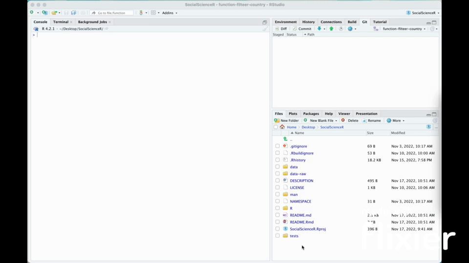

<!-- README.md is generated from README.Rmd. Please edit that file -->

```{r, include = FALSE}
knitr::opts_chunk$set(
  collapse = TRUE,
  comment = "#>",
  fig.path = "man/figures/README-",
  out.width = "100%"
)
```

# socialsciencer

<!-- badges: start -->

[](https://github.com/margotdv04/socialsciencer/actions/workflows/R-CMD-check.yaml)
<!-- badges: end -->

The goal of socialsciencer is to create a package that teaches social scientists who are not comfortable with coding how to use R for data analysis and visualization.

## Purpose

socialsciencer is a package that will teach users how to use R for data analysis and visualization.

## Target Audience

The target audience for socialsciencer are social scientists who are not comfortable with coding for data analysis.

## Installation

You can install the development version of socialsciencer from [GitHub](https://github.com/) with:

``` r
# install.packages("devtools")
remotes::install_github("margotdv04/SocialScienceR")
```

## Example

You can load socialsciencer using the `library()` function.

```{r example}
library(socialsciencer)
```

socialsciencer comes preloaded with data on democracy, human development index, and happiness worldwide.

```{r}
head(country_indicators)
```

socialsciencer also teaches users how to use basic R functions. Here's an example of the view_data() function, which teaches users how to view data loaded in the package in the console.



You can also view the demonstration video on YouTube [here](https://www.youtube.com/embed/L7CdsK5cb5E/0.jpg).

## Proposed R Package

Our proposed R package is what we have described above, a package that teaches social scientists how to use R. We plan to continue this project and expanding its breadth.

## Contributors

[Margot Draillard-Vandenberg](https://github.com/margotdv04)

[Esa Schenck](https://github.com/esaschenck)
